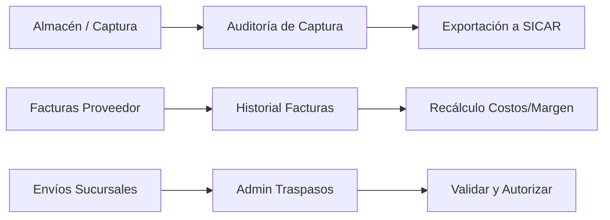

# Documentación de Arquitectura y Flujo de Módulos

Aquí tienes una explicación detallada y estructurada de la arquitectura, funcionamiento y flujo de datos de estos tres módulos de administración e inventario.

---

## 1. Auditoría de Captura (`modulo_auditoria_captura.php`)

Este módulo actúa como el **centro de control y verificación** en tiempo real de las capturas ejecutadas por los operadores en el almacén o piso de venta.

### Proceso y Funcionamiento

1. **Carga y Filtrado de Datos:**
   - Al iniciar, consulta la API backend (`api_listar_capturas_admin.php`) según la fecha seleccionada.
   - Agrupa y lista cada movimiento registrando la hora exactas, el usuario que escaneó, la descripción del producto, la clave SICAR y el destino.

2. **Lógica de Cálculo Flexible (`swIncluirFisico`):**
   - El administrador dispone de un conmutador (*"¿Sumar Estante?"*) que altera dinámicamente cómo se calcula el ajuste final:
     - **Desactivado (Solo Cajas):** Calcula únicamente el stock empaquetado/almacenado ($\text{Bultos} \times \text{Factor}$).
     - **Activado (Cajas + Estante):** Consolida el stock en cajas más el inventario suelto/exhibido en repisa ($\text{Bultos} \times \text{Factor} + \text{Existencia Físico}$).

3. **Diferenciación Visual de Estados:**
   - **Modo Consumo Interno:** Registros marcados como `CONSUMO` se destacan en color naranja.
   - **Registros Exportados:** Los ítems que ya fueron procesados previamente se atenúan (efecto *grayscale*) y se deshabilita la opción de eliminación para evitar duplicaciones.

4. **Flujo de Exportación a SICAR:**
   - **Descargar Día Actual:** Genera un archivo optimizado con las capturas pendientes de la fecha en pantalla.
   - **Descargar Pendientes (Masivo):** Agrupa en un solo archivo todos los conteos acumulados de días anteriores que no se hayan procesado aún, actualizando el estado de la base de datos a `exportado = 1`.

---

## 2. Historial de Recepciones y Facturas (`modulo_historial_facturas.php`)

Es el **motor financiero e identificador de mercancía entrante**. Gestiona el ingreso de remisiones/facturas emitidas por diversos proveedores (como Tony, Paola, Optivosa, etc.).

### Proceso y Funcionamiento

1. **Filtros Servidor y Paginación Cliente (SPA):**
   - Consulta la tabla `historial_remisiones` filtrando por rango de fechas, proveedor y estado (`PENDIENTE`, `ENVIADO`, `FINALIZADO`).
   - Carga el contenido mediante peticiones asíncronas (`fetch`) para actualizar la interfaz como una *Single Page Application* (SPA) sin recargar la página.
   - Incluye una barra de búsqueda local en JavaScript y un paginador con selector de filas por página.

2. **Modal de Auditoría y Edición Profunda:**
   - Al abrir una factura en estado `PENDIENTE`, se activa una interfaz interactiva avanzada:
     - **Control de Presentación (Caja vs Pieza):** Permite cambiar si un producto ingresó como pieza suelta o en paquete/caja, definiendo las piezas por empaque y recalculando las unidades netas.
     - **Gestión de Faltantes y Devoluciones:**
       - Marca ítems con el switch *Faltante* (asigna la clave `FALTANTE` y pone existencias en 0).
       - El administrador puede presionar *Rechazar* para enviar un ítem directamente al módulo de reporte de devoluciones.
     - **Recálculo de Costos y Márgenes (Perfil Visual):**
       - Permite seleccionar el perfil del proveedor y un porcentaje de **Descuento Global (DTO %)**.
       - Calcula automáticamente el **Costo Final Neto** descontando los porcentajes aplicables.
       - Muestra comparativas contra el costo anterior registrado en el sistema y simula los precios de venta sugeridos para márgenes de ganancia del **20%** y **30%**.

3. **Cierre de Factura:**
   - Si la factura está en estado `PENDIENTE`, el botón **Guardar Cambios** envía los ajustes (`enviar_revision.php`) al servidor.
   - Una vez finalizada, habilita el botón verde para descargar la plantilla final lista para importar a SICAR.

---

## 3. Gestión de Traspasos (`modulo_admin_traspasos.php`)

Este módulo controla la **movilización interna de mercancía** enviada entre sucursales o bodegas, garantizando que el stock coincida antes de impactar la base de datos central.

### Proceso y Funcionamiento

1. **Visualización de Transferencias:**
   - Carga la tabla `traspasos` reflejando el número de folio, usuario origen, fecha, volumen de piezas y cantidad de códigos declarados.
   - Clasifica las transferencias mediante dos estatus:
     - `PENDIENTE`: Registros enviados por el personal de almacén que aguardan verificación física.
     - `COMPLETADO`: Traspasos autorizados y auditados por el administrador.

2. **Flujo de Recepción y Validaciones:**
   - **Validación Física:** Al dar clic en el botón de verificación del traspaso `PENDIENTE`, se despliega un modal con la lista de códigos y la *Cantidad Enviada*.
   - **Ajuste de Discrepancias:** El administrador ingresa en el campo *Cant. Recibida* las unidades reales que llegaron físicamente (corrigiendo sobrantes o faltantes).

3. **Cierre y Actualización en Tiempo Real:**
   - Al hacer clic en **Completar y Autorizar**, se ejecuta una transacción SQL que:
     1. Actualiza `traspaso_detalles` con las cantidades finales reales.
     2. Cambia el estado del traspaso a `COMPLETADO`.
   - **Actualización del DOM sin recarga:** Tras la respuesta exitosa del servidor, la interfaz cambia en tiempo real la celda de estado a verde (`COMPLETADO`), sustituye el icono de validación por el de lectura y activa de forma inmediata el botón de descarga XML/Excel para SICAR.

---

### Resumen del Flujo de Datos

